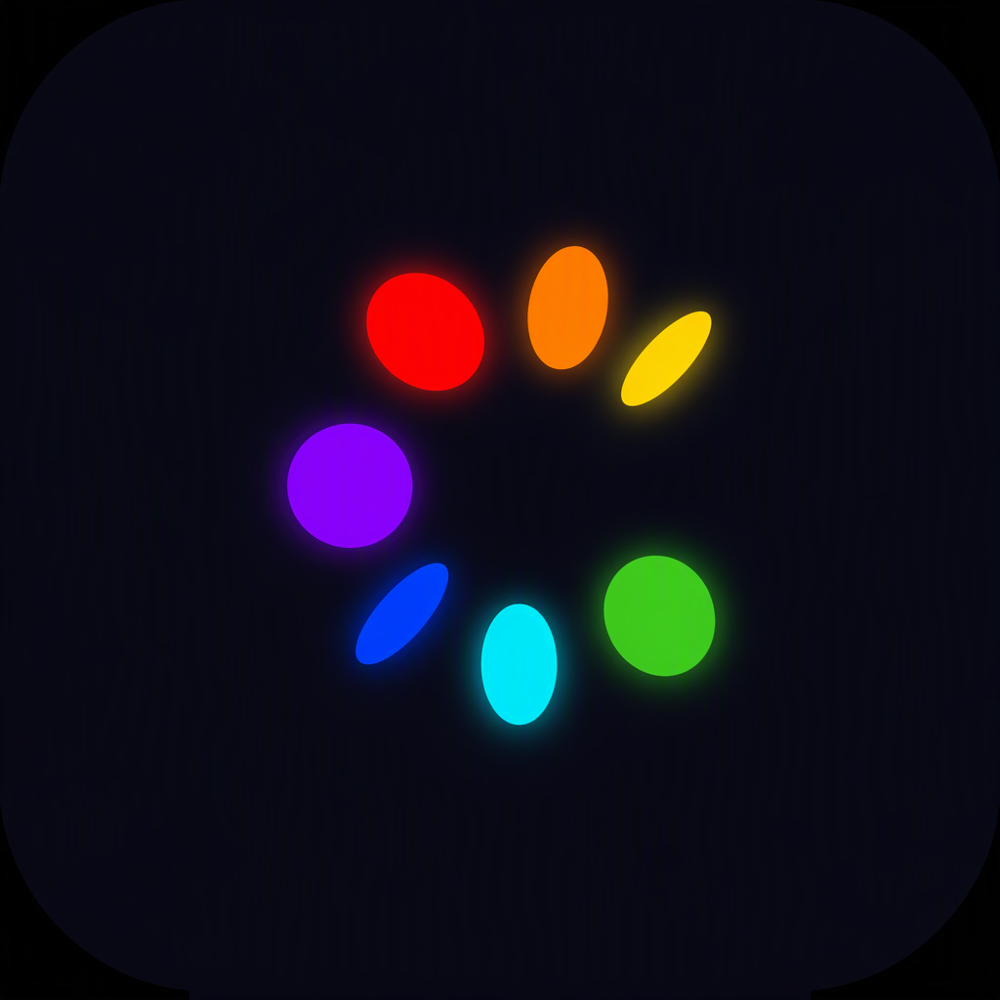
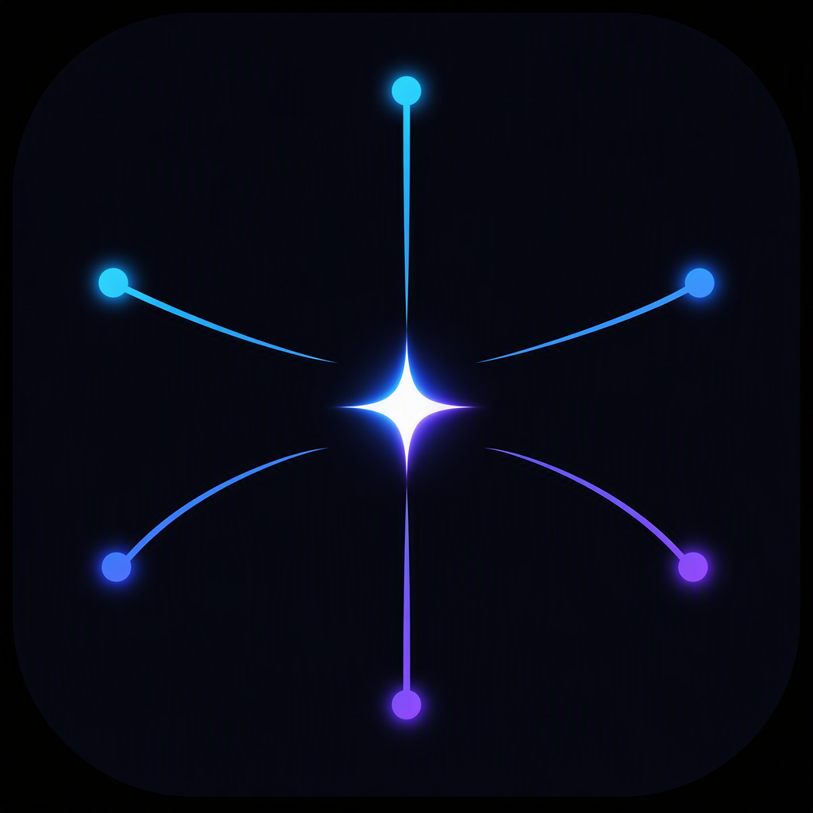
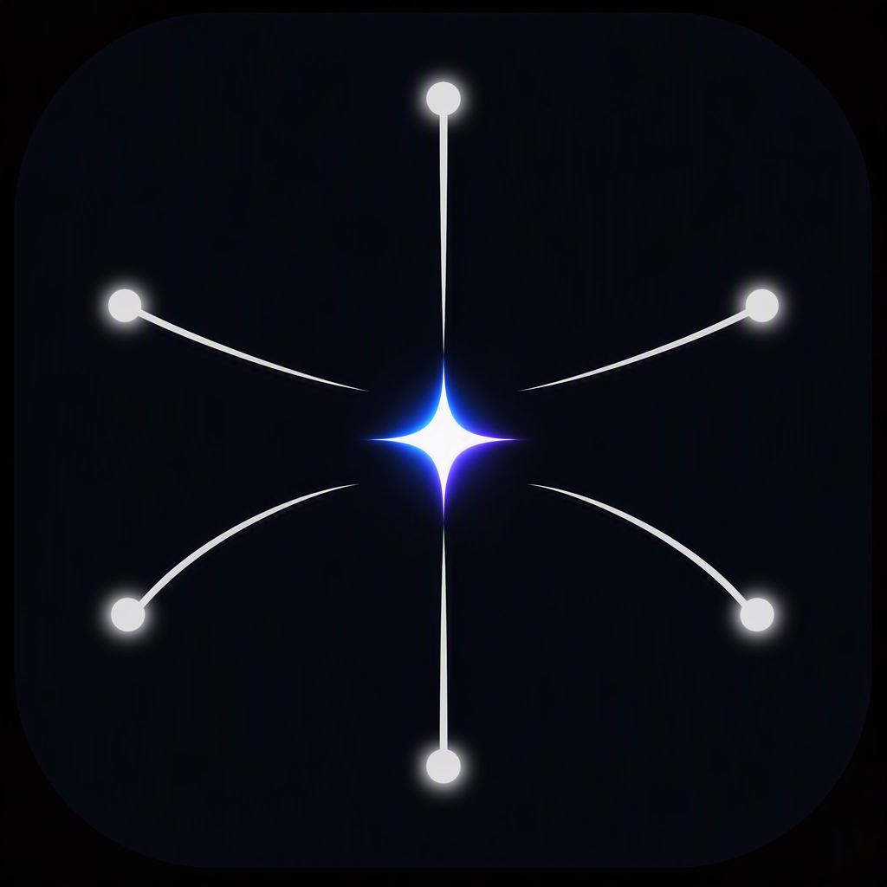
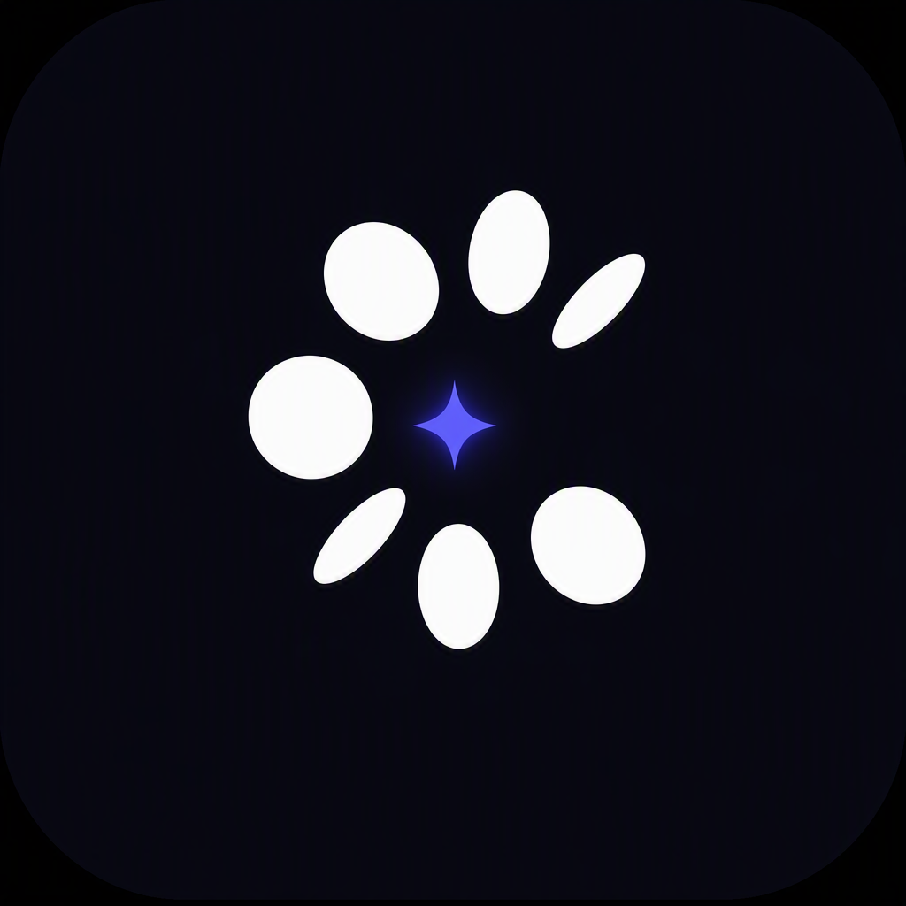
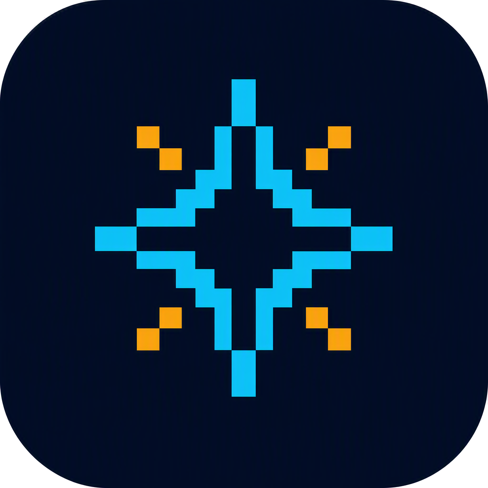
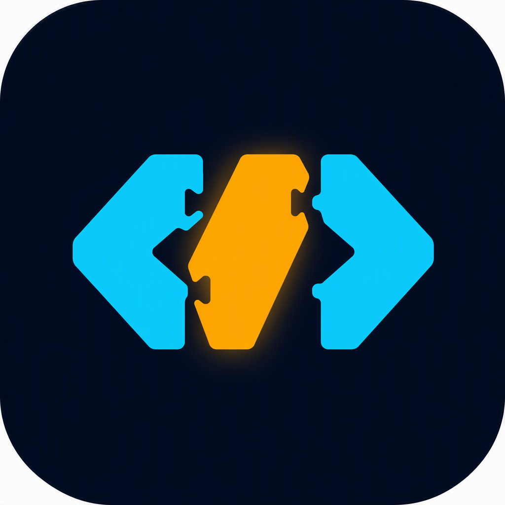
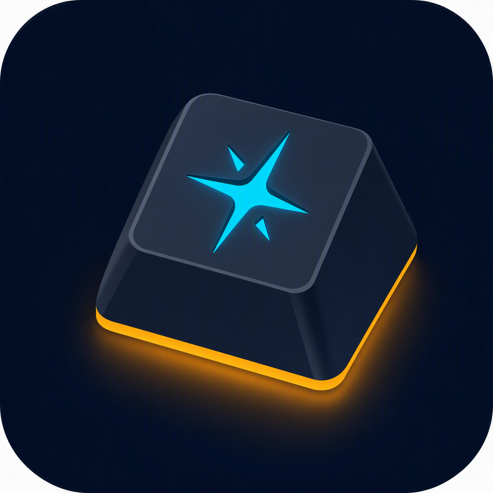
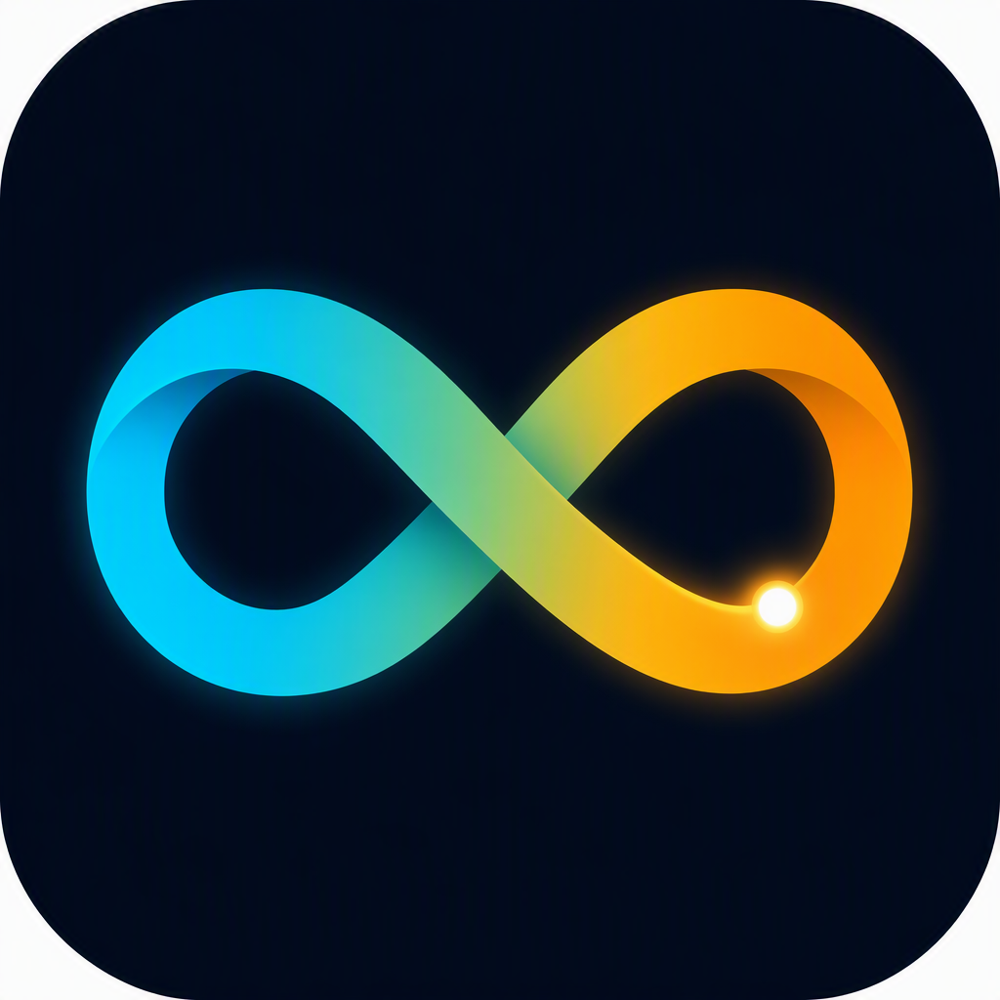
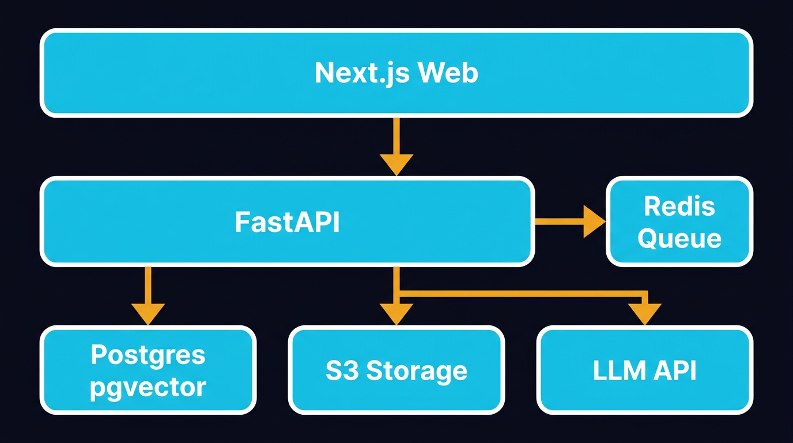

# anycap-examples

Example works built with [AnyCap](https://anycap.ai).

[中文版本 → README.md](README.md) Every entry ships the final asset, the story, and full provenance — brief, candidates, gate results, and why the winner won.

All works here were produced by a human + agent team using the [anycap-skills](https://github.com/convergeai-labs/anycap-skills) playbooks: the human owns brief, taste, and judgment calls; the agent generates gated candidates, builds decision boards, and keeps provenance.

---

## 🌈 convergeai-labs org avatar — the rainbow ring

  

The avatar of [convergeai-labs](https://github.com/convergeai-labs). The composition borrows the parent brand's 7-ellipse radial ring — and dyes each ellipse one color of the rainbow. Seven ellipses, seven hues: **the whole product family (one hue per product) gathered in a single ring.** The official mark is strictly monochrome, so the family resemblance is instant yet impossible to confuse.

It survives the real test — GitHub shows avatars at 32–44px:

   &nbsp;
   &nbsp;
  

### How it was made

17 candidates stood before this one. Six original compositions (converging arcs → star spark, orbit constellation, comet swirl, dot-matrix squircle, aperture blades, ripples), five i2i colorways on the strongest, five derivatives of the official ring itself — every single one passed through a vision gate that rejects text, watermarks, and even icon-template border traces. The rainbow ring's first attempt was rejected for a faint template stroke; the clean regeneration shipped.

| Some of the runners-up | | |
|---|---|---|
|  |  |  |
| converging spark | white + violet core | white ring + violet spark |

📖 **Full story**: [entries/2026-08-convergeai-labs-avatar/](entries/2026-08-convergeai-labs-avatar/)

---

## ✨ kt-aicoding logo — the pixel spark

  

A full logo redesign for [kt-aicoding](https://github.com/kt-aicoding), a developer-tools collective. A chunky 8-bit pixel star — cyan blocks with amber accents. **Ownable** (no orbit atoms, no infinity loops, no rockets), and pixel-hard edges stay crisp at 32px.

   &nbsp;
   &nbsp;
  

### How it was made

The first round — five candidates riffing on the incumbent logo's elements — was rejected wholesale. Instead of polishing rejected ideas, the agent jumped to a **disjoint concept space** (pixel art, keycap, cursor, infinity loop, rocket), and the pixel spark won on ownability. Delivery prep caught two real bugs: opaque white corners (flood-filled to alpha) and GitHub's camo image cache (busted with `?v=2`).

| Some of the runners-up | | |
|---|---|---|
|  |  |  |
| module brackets | spark keycap | infinity ribbon |

📖 **Full story**: [entries/2026-08-kt-aicoding-pixel-spark/](entries/2026-08-kt-aicoding-pixel-spark/)

---

## 🏗 RAG reference architecture — audit-passed system diagram

  

A teaching-grade architecture diagram of a **synthetic reference system** (self-hosted RAG app: Next.js Web → FastAPI → Redis Queue / Postgres pgvector / S3 Storage / LLM API) — deliberately not any real deployment, because the biggest leak risk in a public architecture figure is the system structure itself.

Two disciplines on display: **sanitize the fact graph before generating** (synthetic stack, shareable by construction) and **audit labels, not vibes** (vision gate checked all 6 labels verbatim + all 5 arrow directions; first candidate passed).

📖 **Full story**: [entries/2026-08-rag-reference-architecture/](entries/2026-08-rag-reference-architecture/)

---

## The method

Both marks were produced with the [anycap-brand-mark-lab](https://github.com/convergeai-labs/anycap-skills/blob/main/skills/anycap-brand-mark-lab/SKILL.md) skill: brief → composition candidates → no-text vision gate → i2i colorways → 32px decision board → delivery prep → provenance.

## Entries

| Entry | Asset | One line |
|---|---|---|
| [2026-08-convergeai-labs-avatar](entries/2026-08-convergeai-labs-avatar/) | GitHub org avatar | A 7-ellipse ring borrowed from the parent brand's geometry, each ellipse dyed one rainbow color |
| [2026-08-kt-aicoding-pixel-spark](entries/2026-08-kt-aicoding-pixel-spark/) | GitHub org logo | An 8-bit pixel star — ownable texture, anti-fragile at small sizes |
| [2026-08-rag-reference-architecture](entries/2026-08-rag-reference-architecture/) | Architecture diagram | Synthetic RAG reference system, first candidate passed the label audit |
