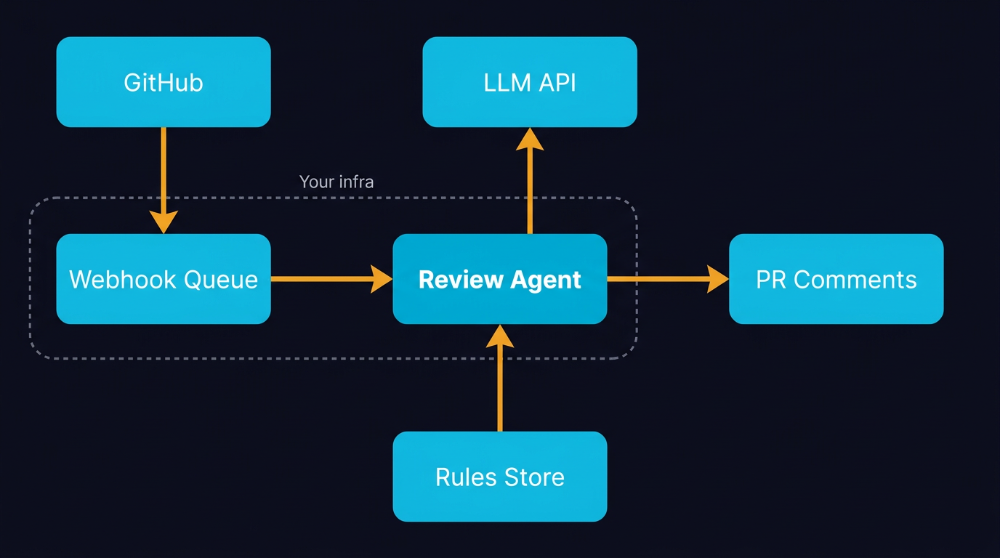
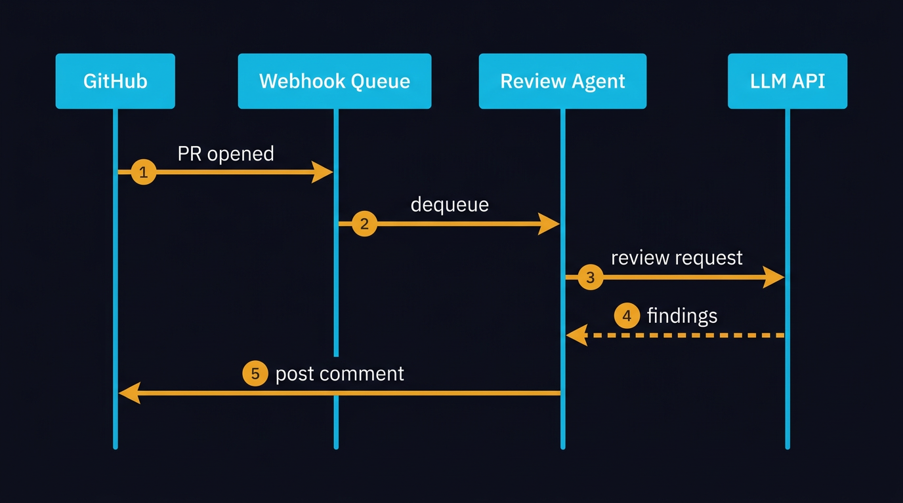
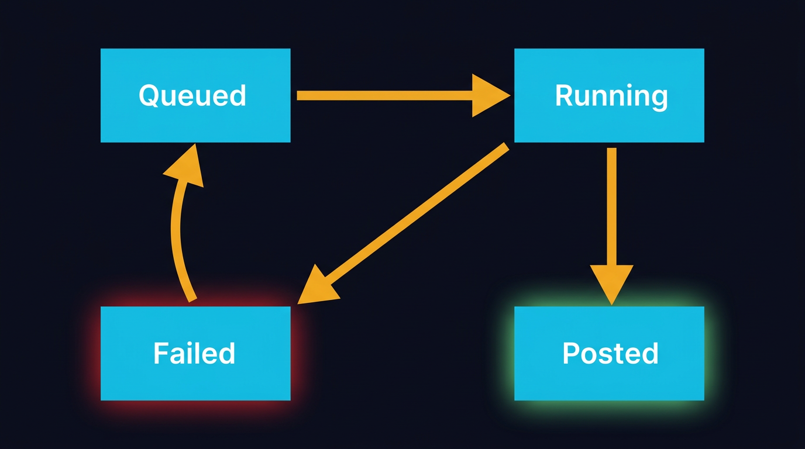
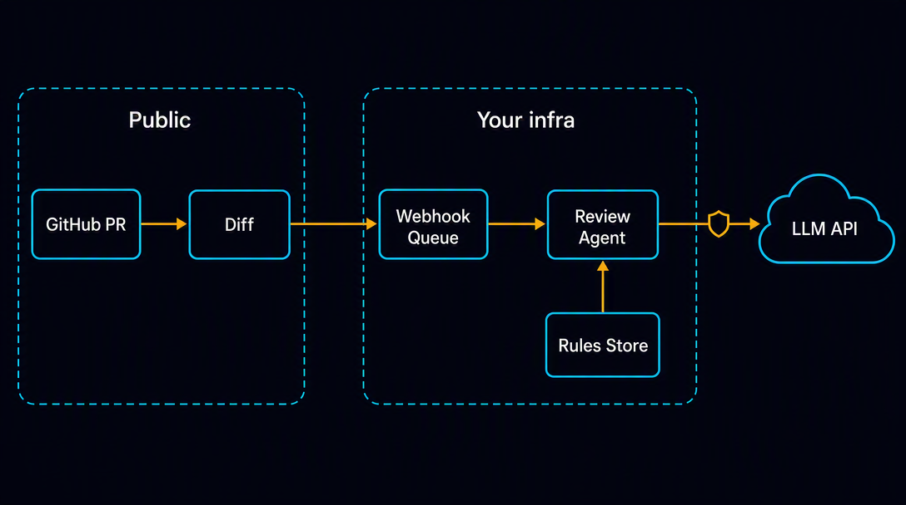
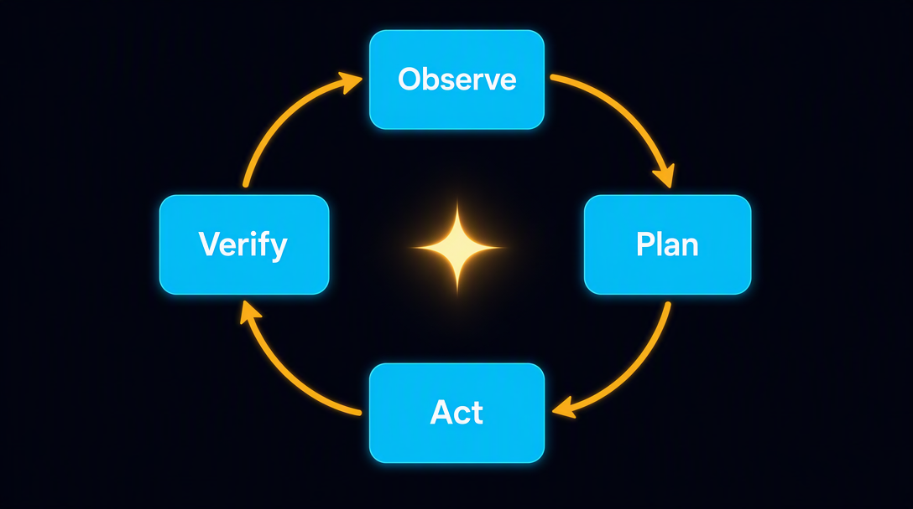

# Diagram grammar gallery — one system, five grammars

Five figures, one synthetic system (a PR review bot: GitHub webhook → queue → review agent → LLM), each answering a **different viewer question** with a different grammar. Every figure passed the label/arrow audit on the **first** candidate.

The point of this entry: diagram work starts from the viewer's question, not from the tool. Pick the grammar by the question, keep the fact model frozen across figures, and stay inside the measured sweet spot (~6 nodes) — then one-shot passes are the norm, not the luck.

| | |
|---|---|
|  |  |
| **g1 系统上下文图** — 什么存在、边界在哪：agent + queue 圈进 `Your infra` 虚线框，外部只剩 GitHub / LLM API | **g2 时序图** — 一次请求如何展开：4 条生命线、①–⑤ 编号步骤、`findings` 虚线返回 |
|  |  |
| **g3 状态机** — 哪些状态和迁移合法：Queued→Running→Posted/Failed→重试，成功/失败用辉光而非颜色单独编码 | **g4 数据流 + 信任边界** — 数据在哪移动/持久化/越界：出界箭头带小盾牌标记 |
|  | |
| **g5 控制环** — agent 如何持续运转：Observe→Plan→Act→Verify 顺时针闭环 | |

## How it was made (agent + skills)

Produced with [anycap-architecture-diagrams](https://github.com/convergeai-labs/anycap-skills/blob/main/skills/anycap-architecture-diagrams/SKILL.md), applying the viewer-question→grammar mapping from the local `image-gen-system` routing taxonomy:

1. **One frozen fact model** for the synthetic PR review bot — 6 component names, reused verbatim across all five figures.
2. **One grammar per figure**, chosen by viewer question (what exists / how a request unfolds / which states are legal / where data crosses trust / how the loop runs).
3. **Five structured prompts**, each carrying its figure's exact label whitelist and arrow spec.
4. **One batch image-read audit** covering all five: `AUDIT-PASS × 5`, first candidates. (g2/g3 via nano-banana-pro; the model backend hiccuped mid-batch, so g4/g5 fell back to gpt-image-2 — the audit doesn't care which model, only whether the labels are right.)

Full fact graphs, prompts, and the audit transcript: [`provenance.md`](provenance.md).
