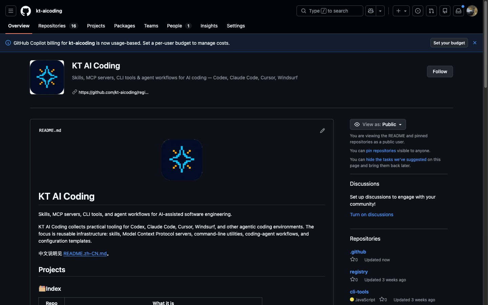

# kt-aicoding logo — the pixel spark

**Final asset**: [`logo-final.png`](logo-final.png) (1024×1024, transparent corners, no text, gate CLEAN)

A full logo redesign for [kt-aicoding](https://github.com/kt-aicoding), a developer-tools collective. A chunky 8-bit pixel star — cyan blocks with amber accents on a dark navy squircle.

## Why this one

- **Ownable.** Orbit atoms, infinity loops, rockets and cursor arrows are the industry's average logo. A chunky pixel texture is instantly recognizable in a sea of flat gradients.
- **Anti-fragile at small sizes.** Pixel blocks have hard edges by design — the mark survives 32px better than any smooth vector.
- **On-theme without being literal.** Pixels are the atom of screens; the spark says "AI". No brackets, no wrenches, no clichés.

## How it was made (agent + skill)

This is the second project produced with the [anycap-brand-mark-lab](https://github.com/convergeai-labs/anycap-skills/blob/main/skills/anycap-brand-mark-lab/SKILL.md) skill, and it validated the skill's most important rule:

1. **Round 1** — five candidates riffing on the incumbent logo's element space (code brackets, circuit nodes, wrenches, toolboxes). All passed the no-text gate. The user rejected the whole round.
2. **The pivot** — instead of polishing rejected elements, the agent jumped to a disjoint concept space: pixel art, keycap, cursor, infinity loop, rocket. The skill now encodes this as an explicit rule: *rejected round → change the concept space, not the seed*.
3. **Round 2** — the pixel spark won on ownability + small-size crispness.
4. **Delivery prep caught two real bugs**: the AI-generated PNG carried opaque white corners (invisible on white, glaring on GitHub dark mode) — flood-filled to transparency before shipping; and GitHub's camo proxy kept serving the old cached image — busted with a `?v=2` bump.

See [`provenance.md`](provenance.md) for the full candidate table and gate records.
