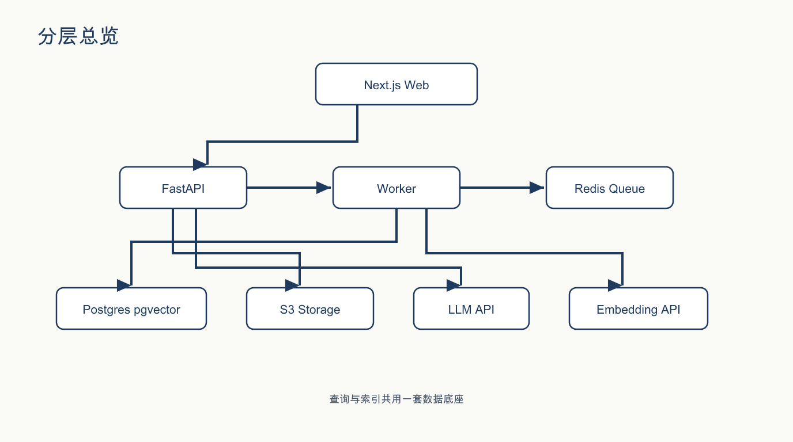
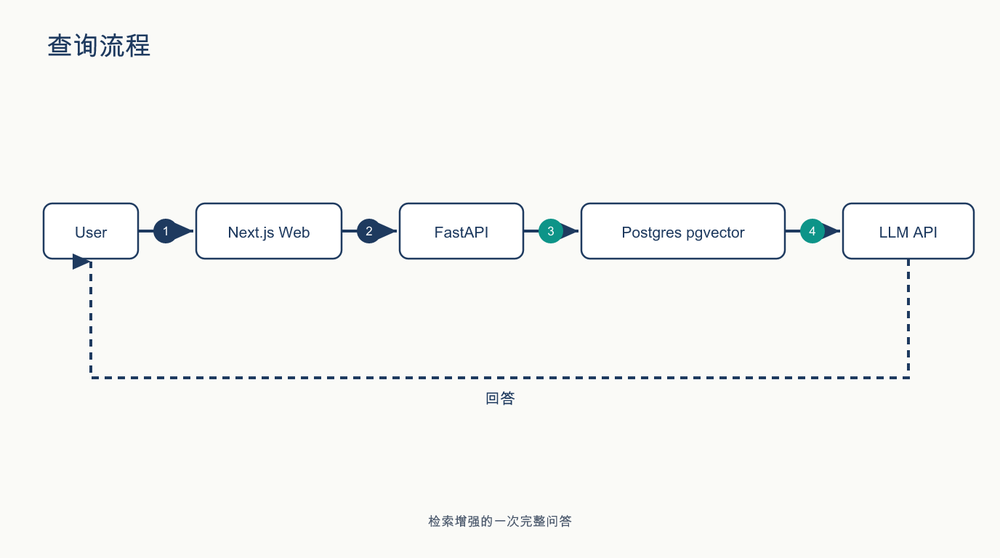
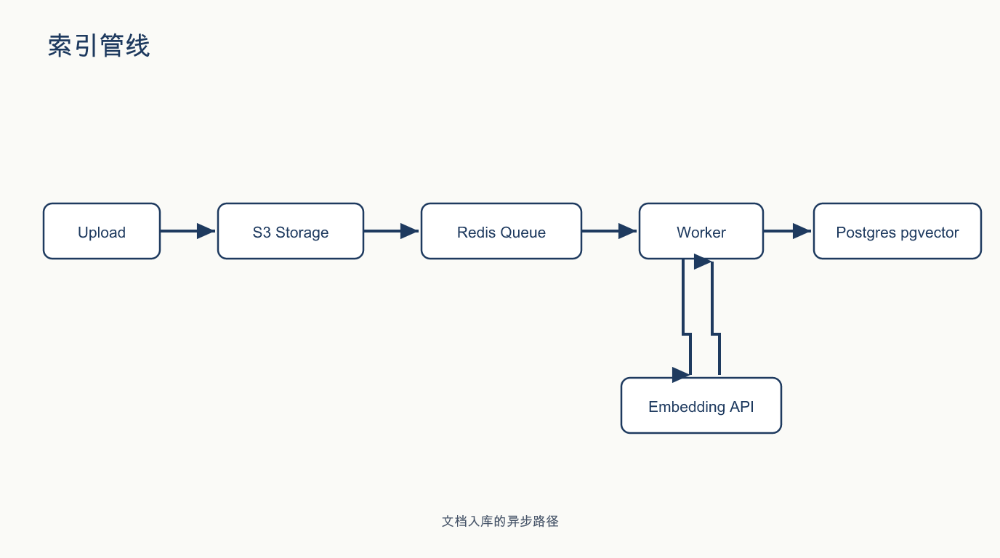
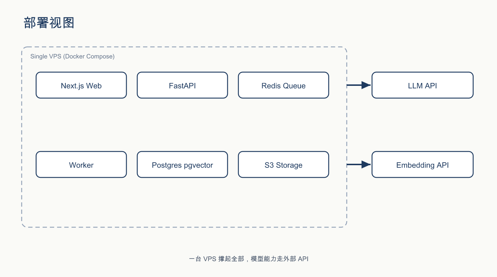

# RAG reference architecture — labeled system diagram

**Final asset**: [`architecture-final.png`](architecture-final.png) (16:9; editable SVG source included)

A teaching-grade architecture diagram for a small self-hosted RAG chat application — a **synthetic reference system**, deliberately not any real deployment: `Next.js Web → FastAPI → Redis Queue / Postgres pgvector / S3 Storage / LLM API`.

**Style note (v2):** the original set used dark-navy "dashboard chrome". The current set is the editorial visual language (warm-white canvas, navy structure, bold Chinese title + takeaway caption). The dark versions are kept in [`v1-dark-dashboard/`](v1-dark-dashboard/) as before/after evidence.

## Why this entry exists

Architecture diagrams are the highest-risk figures to produce with an image model: they carry **exact labels and arrow directions**, and they leak internal system structure if you feed real ones. This entry demonstrates the two disciplines that make it work:

1. **Sanitize the fact graph first** — the subject is a synthetic stack (a generic Python/FastAPI + Next.js RAG app), so the diagram is shareable by construction. No internal system was ever involved.
2. **Audit labels, not vibes** — the vision gate checked every label against an exact whitelist and every arrow direction against the spec. First candidate passed.

## How it was made (agent + skill)

Produced with [anycap-architecture-diagrams](https://github.com/convergeai-labs/anycap-skills/blob/main/skills/anycap-architecture-diagrams/SKILL.md):

1. **Fact graph frozen in text** — 6 nodes, 5 edges, exact label whitelist. Nothing else allowed in the image.
2. **One structured prompt** — layer grammar → node inventory with exact labels → edges with direction → style → "no extra text".
3. **One image-read audit** — labels verbatim, arrows by direction, pseudo-text scan → `AUDIT-PASS`.
4. Done in a single generation. The skill's rule for when it doesn't go this well: one concrete failure → regenerate naming the failure; two failed audits → switch to the hybrid branch (no-text plate + deterministic labels).

**v2 style upgrade (2026-08-21):** the editorial restyle was done **deterministically** — all five figures are hand-authored SVGs (sources included next to each PNG), because exact topology + editorial style were both required and the generation budget was exhausted mid-task. Generated pixels are the explanation layer; deterministic sources are the truth layer.

The full fact graph, prompt, and audit transcript are in [`provenance.md`](provenance.md).

## The multi-view set (small multiples)

One diagram answers one question — so the entry grew into a coordinated 4-view set, all projecting the same frozen fact model (same node names, palette, typography, connector style):

| | |
|---|---|
|  |  |
| **v1 分层总览** — full 8-node × 8-arrow topology | **v2 查询流程** — sync query path with step numbers |
|  |  |
| **v3 索引管线** — async ingest path | **v4 部署视图** — single-VPS boundary |

The set is also the skill's branch rules playing out for real:

- **v2 / v3 / v4** (5–6 nodes each): T1 generation, `AUDIT-PASS` on the first candidate — the sweet spot.
- **v1** (8 nodes × 8 arrows): three T1 attempts each missed exactly **one** arrow, a different one every time — the classic fix-one-break-another carousel. Per the rule ("two failed audits → switch branch"), v1 retreated to a **deterministic SVG** ([source](views/v1-overview.svg) kept, fully editable). Generated pixels are the explanation layer; the deterministic source is the truth layer.

Lesson measured, not guessed: **the T1 full-generation ceiling is ~6 nodes**; beyond that, arrows start drifting one-per-roll.
